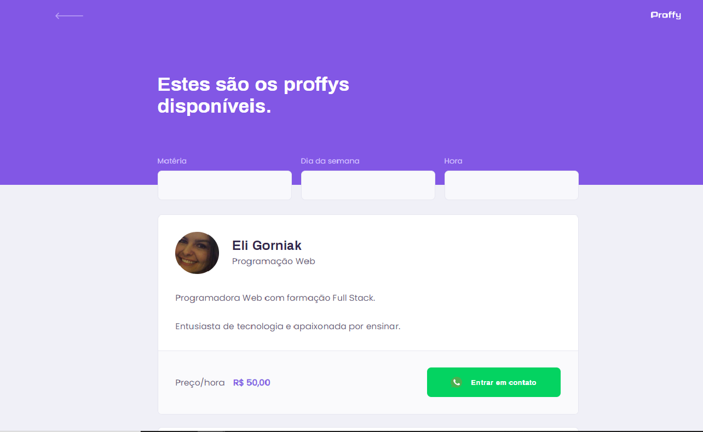
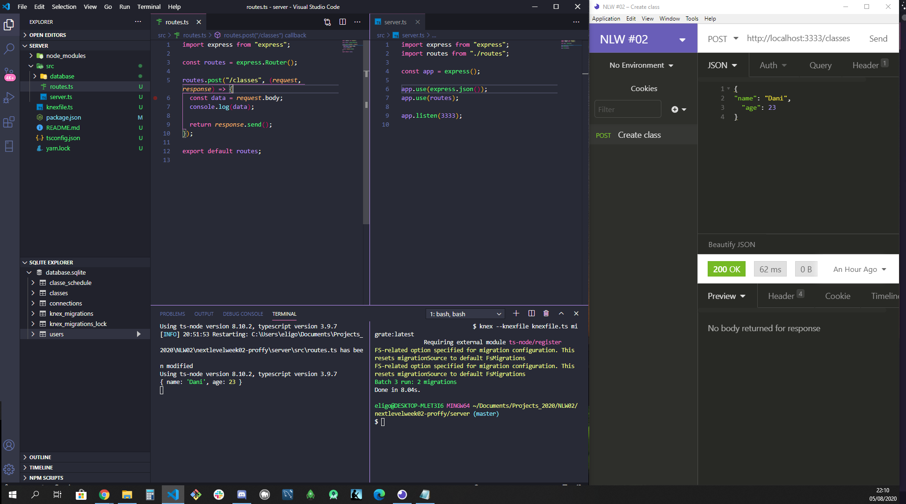
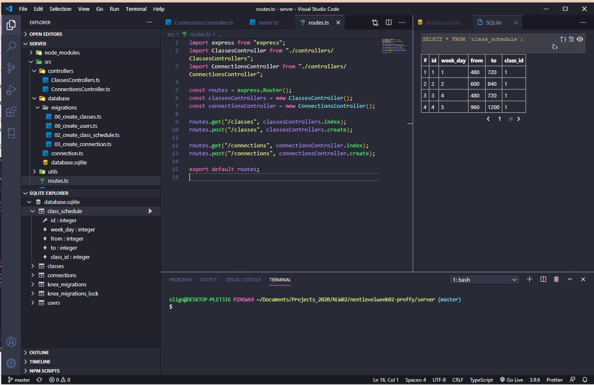

# Eli Gorniak

### 100 Days Of Code - Log

This is a funny and strong way to learn more about Web Development technologies and tools.
You can found more detais about the challenge here: https://www.100daysofcode.com/.

---
### Challenge 
The challenge is:
- [x] code everyday for 100 days.
- [x] try to learn as many programming skills as possible.
- [x] tweet your progress every day with the #100DaysOfCode hashtag.
- [x] encourage others who are doing the same challenge on Twitter or elsewhere.
- [x] commit to the Log on Github repo daily.

---
### Starting
| Start Date |
|----------|
| 08/03/2020 |

---
## Code Log
### Day 01 - August, 03 2020 - Monday

**Project:** Proffy - A platform made with React, React Native and Typescript for teachers and students.

**Today's Progress:** Today I started following the first video of Next Level Week 02 Course promoted by https://github.com/Rocketseat (https://nextlevelweek.com/episodios/omnistack/1/edicao/2), entirely in Brazilian Portuguese. During this week (08/03 to 08/07) the videos will be available daily with all the project.

**Thoughts:** Today was a good oportunity to remember some basic concepts about React and CSS. It's the first time that I'm using Typescript on projects.

**Link to work:** https://github.com/EliGorniak/nextlevelweek02-proffy

---

### Day 02 - August, 04 2020 - Tuesday
**Project:** Proffy - A platform made with React, React Native and Typescript for teachers and students.

**Today's Progress:** Today I concluded the level 01/05 of Next Level Week 02 Course, finishing 2 pages of frontend. Next step will be working with on server side/backend (Node, Express, dB).

**Thoughts:** Basically, today was easy just working with the Typescript sintaxe and components in React.

**Link to work:** https://github.com/EliGorniak/nextlevelweek02-proffy

---
### Day 03 - August, 05 2020 - Wednesday
**Project:** Proffy - A platform made with React, React Native and Typescript for teachers and students.

**Today's Progress:** Started working on backend, using Knex and SQLite3, controllers and routes.

**Thoughts:** I experienced 2 new technologies, Knex and SQLite3, once the application is small and doesn't require a huge database. Tomorrow I'll finish the second level of the course.

**Link to work:** https://github.com/EliGorniak/nextlevelweek02-proffy

---
### Day 04 - August, 06 2020 - Thursday
**Project:** Proffy - A platform made with React, React Native and Typescript for teachers and students.

**Today's Progress:** Conclude backend, using Knex and SQLite3, Insomnia for Node testings on db.

**Thoughts:** Today was easier than yesterday just keep following the backend, but some new concepts like transactions and convertions ways for hour/min in a db.

**Link to work:** https://github.com/EliGorniak/nextlevelweek02-proffy

