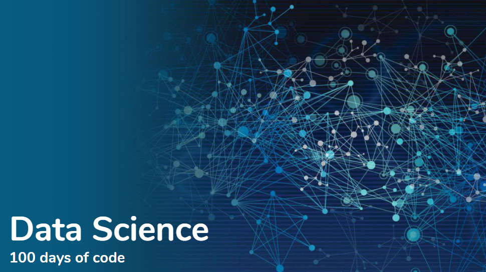
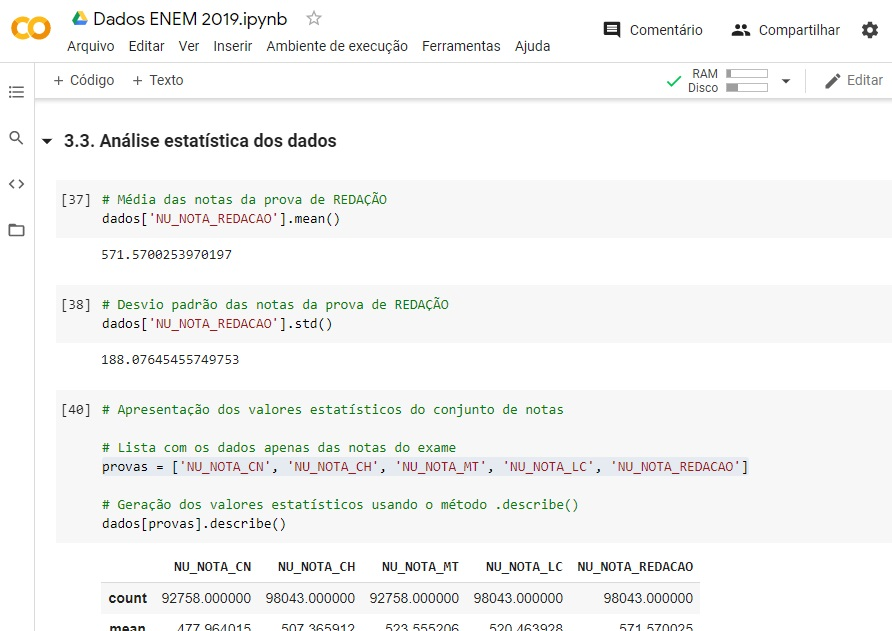

# 100 Days Of Data Science Code
### Log of activities

### :writing_hand: About
- On this daily log I'll be posting my trajetory studyin Data Science, it technologies and new aspects, since I intended to know more about DS and work on this field.
- This is part 100DaysOfCode challenge, created by Alexander Kallaway.
- You can found more detais about the challenge here: https://www.100daysofcode.com/.
- You can follow my progress on Twitter https://twitter.com/eligorniak.

---
### :dart: Challenge 
The challenge is:
- [x] code everyday for 100 days.
- [x] try to learn as many programming skills as possible.
- [x] tweet your progress every day with the #100DaysOfCode hashtag.
- [x] encourage others who are doing the same challenge on Twitter or elsewhere.
- [x] commit to the Log on Github repo daily.

---
### :spiral_calendar: Starting
| Start Date |
|----------|
| 10/21/2020 |

---
## :chart_with_upwards_trend: Code Log

### :bar_chart: Day 001 - October 21, 2020 - Wednesday 

**Project:** EDA of ENEM 2019 dataset, the most important educational exam in Brazil.

**Today's Progress:** Today I started following the first video of Data Immersion Week, by https://www.alura.com.br/imersao-dados, entirely in Brazilian Portuguese. During this week (10/19 to 10/23) the videos will be available daily with all the project.

**Thoughts:** Today was a good oportunity to start working with Google Colab, Python and some libs, like Pandas, Seaborn, Matplotlib and Numpy.

**Link to work:** https://github.com/EliGorniak/Imersao_Data_Science_Alura_2aEd._2020

---
